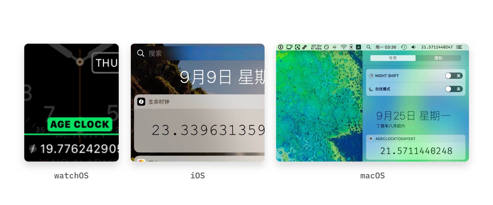

# About
> Age Clock is a small app to track how many years you have lived, but at the precision of 10 digits.  
The idea of Age Clock came when I am 19 and about to become 20. When I was still a child I used wondered why products in super-market were all listed with a "x.99"-ish price tag, like ¥19.9. Years later I became a grown-up and finally understood the reason behind it, that 19.9 creates an illusion of paying for less, and I can't help but to think what difference would put on me if I am 19 plus 11 month or just 20, will I suddenly become less favorable and valuable to others? This clock is then made to remind me that every second counts.  

# Screenshots

