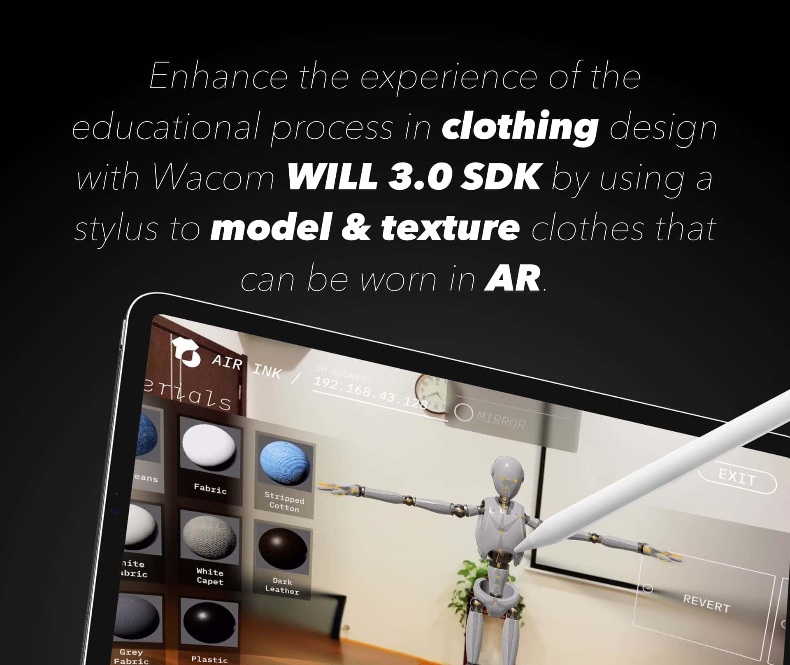
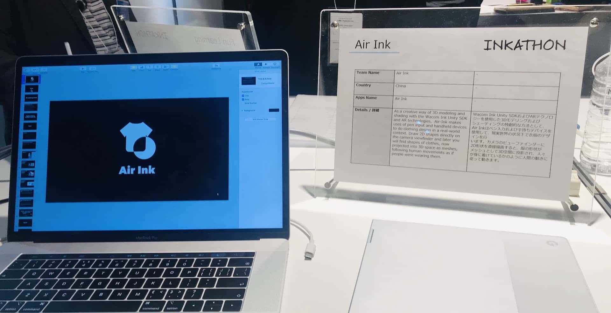

# About
> Wacom Inkathon Tokyo Final Round & Connected Ink Presentation Project.  
AirInk is an experimental Unity based application to explore the possibilities in clothing design with AR.  

# Issue
> Modern clothing design software, like Marvelous Designer, has 3 main issues.
> - Designers work on 2D-only inputs like monitors and mouses for 3D modeling. They also have difficulties understanding the concept of UV projection.
> - The virtual avatar in the preview only have static poses, and the lighting is pre-defined. Thus, clients could not visualize how will the final product look as they want.
> - Designers work on workstations with a file based workflow which prevents them from having a seamless collaboration experience.
>
> Air Ink tries to solve these issues with AR and Wacom SDK, using a sketch-based-modeling approach.
> - In AR space, the viewer itself functions as a 3D anchor. The strokes designers painted would then be projected from 2D space into 3D space. It is all done in 3D space so there isn't UV to concern about for the user side.
> - ARKit offers skeleton tracking and environment probe which make it possible for clothes to follow natural human locomotion and adapt to real-world lighting environment.
> - All meshes are synced across the devices, which means many designers can work on the same project.
>
> The concept of 'making clothes follow human movement as if the person is wearing them' is practical, though my implementation is somehow far from production-ready due to reasons I will mention later. For now, please check out the slides and the demo video.

# Video
> We presented this demo video and the corresponding [slides](https://docs.google.com/presentation/d/1pj1M9PgelQdfj4YcCLqNvO7SBaJC4x_A-hoDLldqxb0/edit?usp=sharing) on the Connected Ink 2019 Event. As I said, the result is far from satisfying, currently I think Air Ink can only be used as a prototyping tool, it is rudimentary, but fun.

<video class="video-js vjs-default-skin vjs-big-play-centered" controls data='{ "fluid": true, "techOrder": ["youtube"], "sources": [{ "type": "video/youtube", "src": "https://youtu.be/DfBqddoBXmw"}] }' > </video>

# Tech Detail (and Difficulties)

> **So, what did we use?** We use Unity 2019.3, Wacom WILL 3 Unity SDK (still in early release), and ARKit 3.   
In Unity we use [Mirror](https://github.com/vis2k/Mirror) to sync skinned mesh across devices. It is pretty stable and easy to use, the only catch is you need to write your own serialize and deserialize methods for the class Mesh. In our case, we need to save vertex, triangle, and bone wrights because it is a skinned mesh. We do not need UV info as we are using triplanar shaders which is UV-free.  
In order to convert static mesh into dynamic skinned mesh, we need to decide the which joint should each vertex follow. In the initial version (for the Tokyo Final), we are using CPU based calculations and hard slices with no smoothing, and it was ugly.  
Later I found [Skinn Vertex Mapper](https://assetstore.unity.com/packages/tools/animation/skinn-vertex-mapper-free-edition-147853), which is a GPU based mapper, and consequently is faster and better in results. But Metal API has strict rule on compute shaders so Skinn won't work on iOS. I have to transfer the calculation work to a desktop server for it to work.  
Despite all these efforts, Air Ink is pretty still lame in terms of the quality of skinned mesh. The reason is that the mapper cannot infer the intention correctly. If you want to draw a tie, you want it to stick to joints nearby, but if you want to draw a dress, you want it to float in the mid air and free from any skinning process. Often the mapper cannot tell what behavior do you want, and even if it does, joints in T-Pose are very close to each other so the mapper would just bind the wrong joint.
>
> As for the ARKit, there isn't much to say (though most of the time I am debugging with ARKit Unity plugin), but here are 2 things anyway. 
> - Motion Tracking cannot work with Human Segmentation as they are using different `ARTrackingConfiguration` ([Related Issue](https://github.com/Unity-Technologies/arfoundation-samples/issues/345)), which is a big bummer for me. I had to convert a depth estimation model into CoreML to work with ARKit for a proper occlusion effect.
> - Motion Tracking in ARKit 3 would provide a height scale value, which is useful if you are tracking non-life-size figures, or just people displayed on small monitors.

# Other Stuff
> Given the fact that this project is not production-ready (at least in my opinion), I am pretty surprised that Wacom is willing to offer us tickets to Tokyo. But they said to me that the idea is great, and I appreciate that.   
This is our booth at the Connected Ink Event:  

> Also, you are welcome to check other speakers' amazing projects on [event website](http://connectedink.wacom.com/en/#un_ancBlock_timeTable), with the session title 'Winner Presentation of Inkathon Developer Challenge (Teams from US, JP, AP)'.
