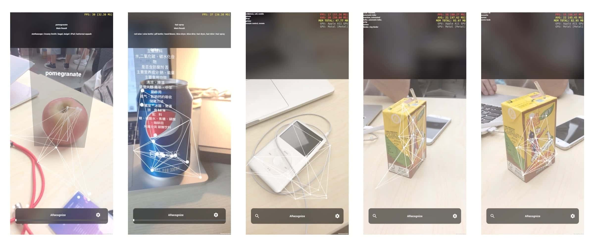
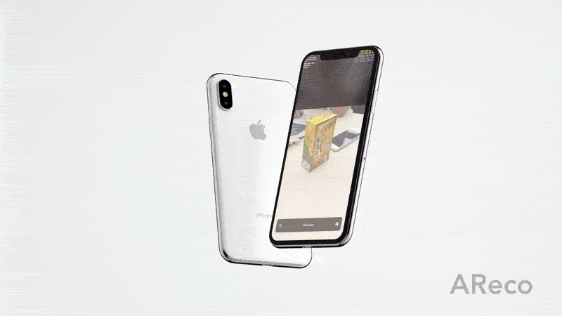
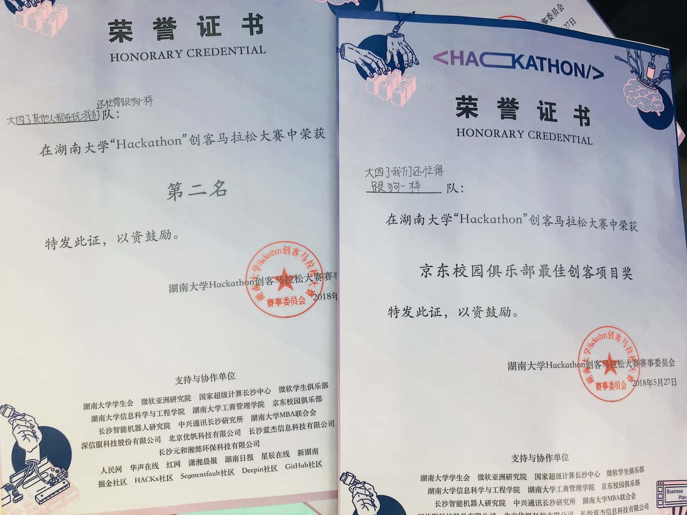

# About
> Hunan Huazhong HHHackathon #2 Prize.   
AReco is a wiki app that leverage the power of ARKit and CoreML. With the help of MobileNet, AReco can recognize common objects and shows a info-graphic layer in AR world space. A special feature points meshing effect was also implemented using Scrawk's [Convex Hull](https://github.com/Scrawk/Hull-Delaunay-Voronoi) algorithm.  

# Screenshots

# Meshing Effect
> As you can see in the gif below, there are moving dots and lines that construct a wire-frame model in real-time. Actually, this is not a real-time meshing. It's just an effect that mimics meshing. The triangulation work with feature points recognized by ARKit was achieved by the Convex Hull algorithm, then I simply called Unity to draw lines between triangulation connections.

> Also credit to [anthonyboyd](https://www.anthonyboyd.graphics)'s amazing animated mockup.

# Author
> Lin Li, Jiayang Ao, and Haotian Zheng (Team '大四了我们还忙得像狗一样')

