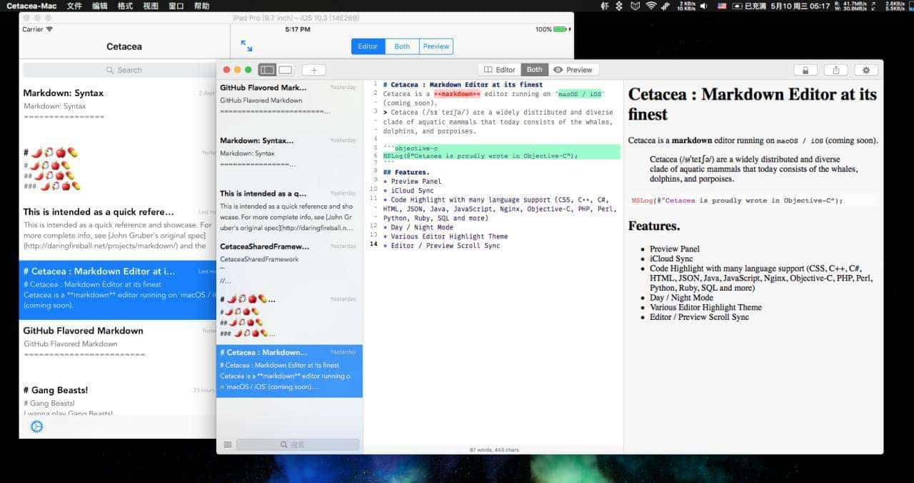
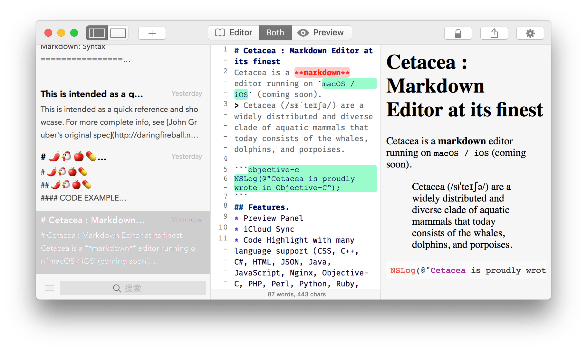
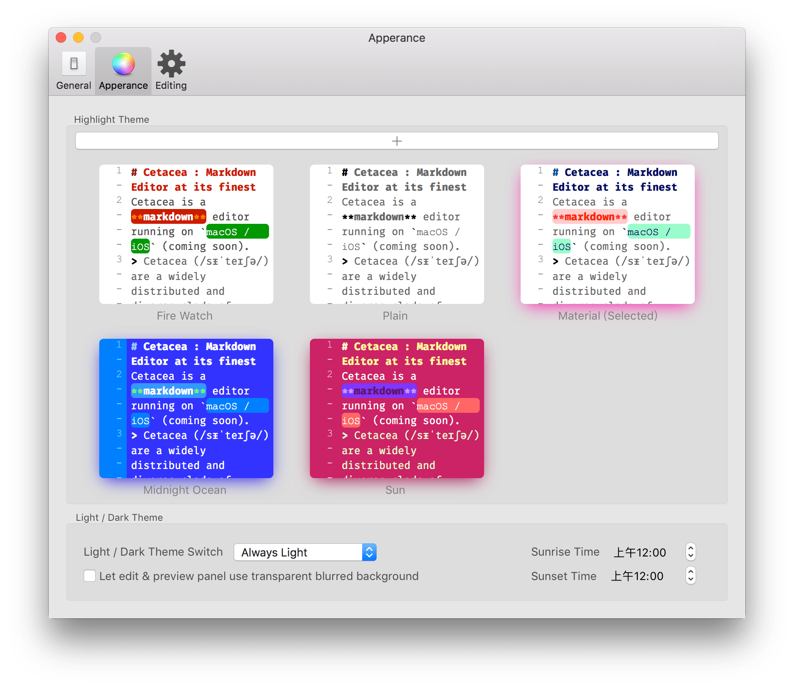

# About
> Cetacea is a markdown written for iOS & macOS. When building Cetacea, I managed to maintain both iOS and macOS versions in a workspace, with most reusable codes in a framework called "CetaceaSharedFramework". You can see that Cetacea was running on iOS simulator and macOS at the same time in the image below.  
    
 

# Screenshots

# Releases
> Cetacea was abandoned due to technical difficulties mainly. Also, I didn't have enough time to pull it off as later I went to Baidu for an internship.