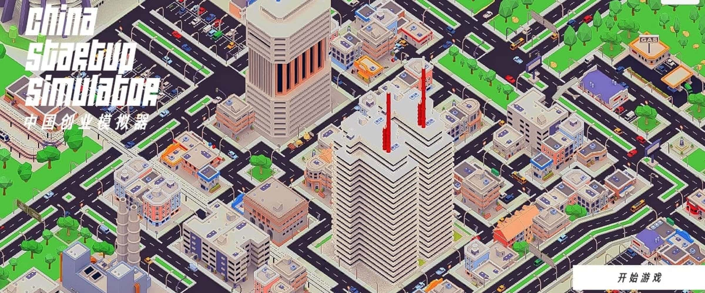
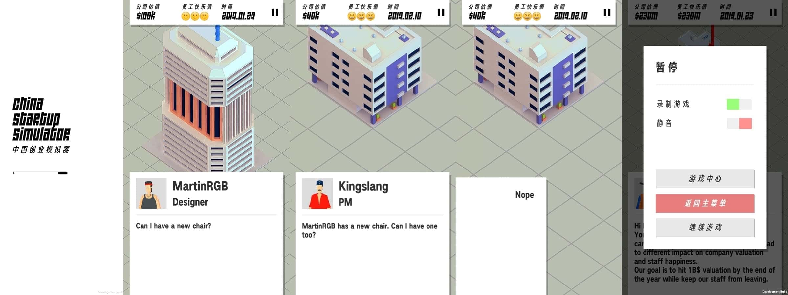

# About

> Inspired by the "Unicorn Startup Simulator", China Startup Simulator is a simulator game where you act as a startup entrepreneur swiping cards to reply to your staff, which would have different impacts on company valuation and staff happiness.

# Screenshots

> And some in-game UI:

# Releases
> Sadly this thing never went on store because I went for an internship at Baidu in the middle of the development, then this project got abandoned. I [wrote a story tree editor](https://www.justzht.com/css-cetacea-dev-blog/) for this, and the editor plugin was abandoned, too.
