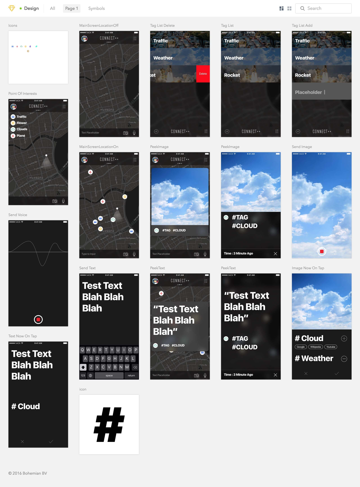

# About
> Third Prize of i-lab Shanghai Hackathon 2016. A LBS information sharing platform. I did the design work in this project. Built by [hACKbUSTER](https://github.com/hACKbUSTER).        
  For more info about this hackathon, please visit my [blog](https://www.justzht.com/2016-10-17/).

