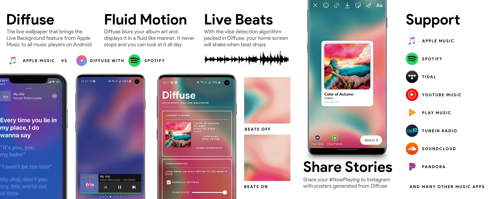

# About
> Diffuse is an app that tries to mimic the look of [Live Lyrics]() feature added in Apple Music (iOS 13 and up). The album art is blurred and distorted in an abstract, liquid-like form, and it shakes when beat drops using beat detection algorithms.

# Video
<video class="video-js vjs-default-skin vjs-big-play-centered" controls data='{ "fluid": true, "techOrder": ["youtube"], "sources": [{ "type": "video/youtube", "src": "https://youtu.be/6j41so6OTGE"}] }' > </video>