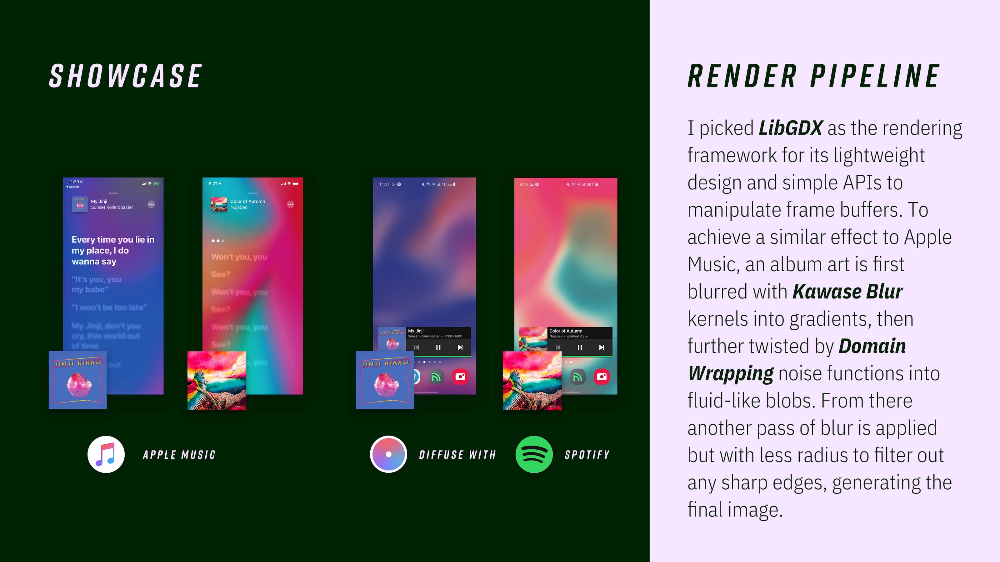
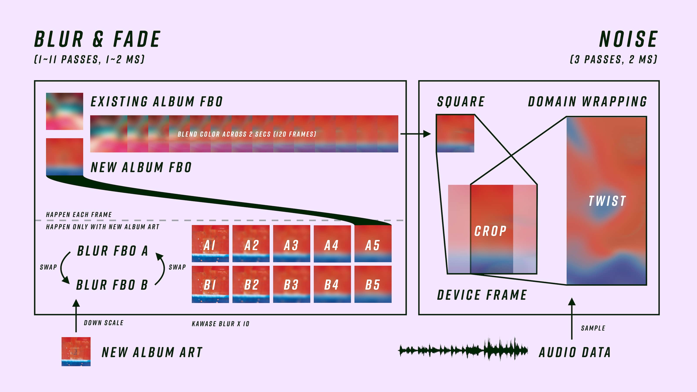

# About
> Diffuse is an app that tries to mimic the look of [Live Lyrics](https://support.apple.com/en-us/HT204459) feature added in Apple Music (iOS 13 and up). The album art is blurred and distorted in an abstract, liquid-like form, and it shakes when beat drops using beat detection algorithms.

# Video
<video class="video-js vjs-default-skin vjs-big-play-centered" controls data='{ "fluid": true, "techOrder": ["youtube"], "sources": [{ "type": "video/youtube", "src": "https://youtu.be/6j41so6OTGE"}] }' > </video>

# Technical Details
> Diffuse was built with LibGDX and Material Componments.  
> Once it gets notification access, it will constantly monitor now-playing notifications from music apps and grab the album art.
> The album art will then be blurred using [Kawase Blur from Intel](https://software.intel.com/content/www/us/en/develop/blogs/an-investigation-of-fast-real-time-gpu-based-image-blur-algorithms.html)
> and blended (lerp) with existing ones over a certain time period. Then the blurred image will be fed into a [domain wrapping](https://www.iquilezles.org/www/articles/warp/warp.htm) shader
> for fluid-like visualizations, with additional parameters like audio loudness / FFT value as offset to achieve the "live beats" effect.  
> Below are images from my [PDF version portfolio](https://fincher.im/Portfolio.pdf), and I think they explain well what Diffuse does within a frame.

