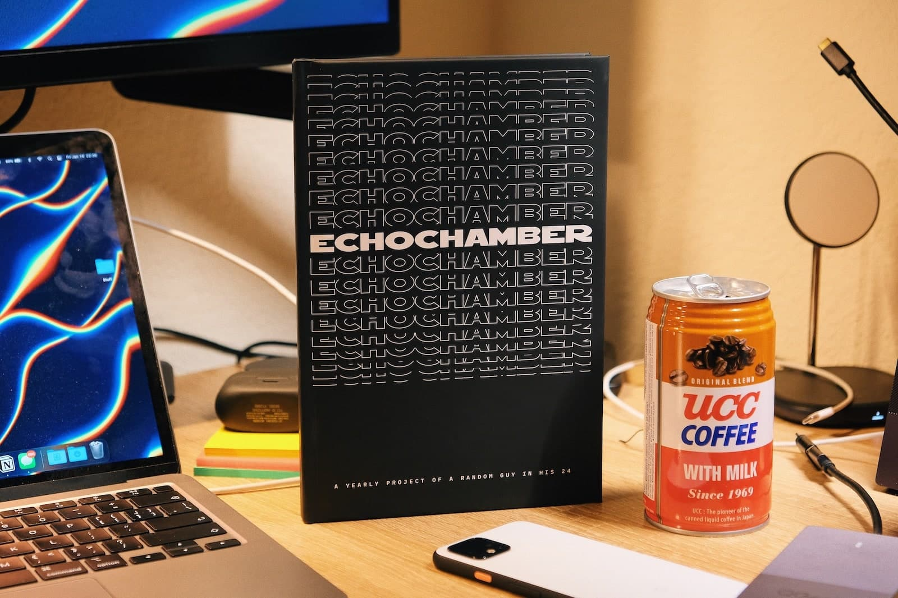
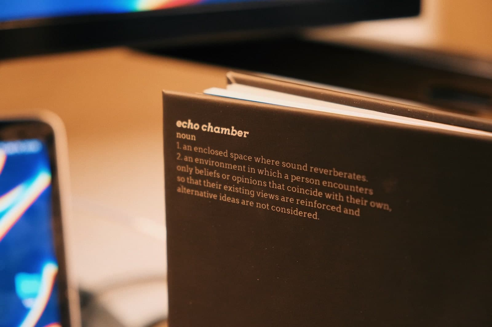

# About
> Echo Chamber is a compilation of posts made on my blog, Twitter, Instagram, and other platforms, as an attempt at self-publishing as well as a yearly project.

# Physical Copy
> Blurb and Amazon Self-Publishing were chosen for the physical print. Below are pictures of the Blurb version, which you can purchase via their [Website](https://www.blurb.com/bookstore/invited/9456135/ee39285c6dd67ca7c99dd22eb680dd9d9f3c17a3).

 

  
<b>Click to see additional images</b>

> Additional Images

 

# Design
> The book was designed in Sketch. Each page contains a set of guidelines (Safe area, Trim, Bleed, etc) to match with the specification (6x9 inches, 15x23 cm, Hardcover).
> Images and texts were then added to the page and positioned to match with the guidelines.

# Web Reader
> The [web reader](https://2021.justzht.com/) was built with Vue and TurnJs to mimic the feel of a real book.