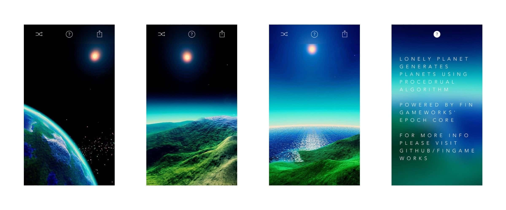

# About  
> Lonely Planet (now called "Epoch Core" due to trademark issues), is a tech demo for my procedural space shooter project ("Epoch").  
In order to achieve fast planet generation, I ported a subset of C++ based libNoise into the cg shader language. As noise data is then generated in parallel (by shader), the total generation time of a 2048x1024 sized height-map was shortened from 8-15 seconds to around 120 ms (Tested on iPhone 6S). That's blazing fast.

# Screenshots

# Tech Issues
> When I had to pause the development of Epoch due to full-time internship and school-related stuff in 2016/2017, I took all the usable components to create Epoch Core, a demo for showcasing what has been done.  
> And being a Unity project in 2016, the Epoch Core has several issues in today's view:  
> - **Precision**: The height map for the planet was generated in shader, and thus, though it is definitely faster, it suffers the lack of precision compared to CPU based solution. You can see that gap between meshes sometimes as the offset wasn't aligned.
> - **Flexibility**: The height map was generated using Render Texture (as Compute Shader support on mobile wasn't really there in Unity 5.x and 2017.x), which means the generation isn't progressive. It would take half a second (including shader rendering and texture read-back) to finish a 2K sized texture, and if you want a higher resolution on a certain area, you need to generate a 4K size texture that includes all areas. There wasn't any mipmap or adaptive sampling involved so this solution lacks flexibility in switching generation sizes. A CPU-GPU hybrid solution might be better though.
> - **Clouds**: There is no cloud in the demo. I tried billboard particles and they didn't handle that 'volumetric' feeling well. I tried some screen-based ray-marching solutions and while the results were stunning, the performance was hugely impacted.

# Video
> This is the demo video of Epoch, the main project behind the Epoch Core. Epoch is still in heavy prototyping & developing (currently the development is paused with no ETA). If you are interested in the game, you can visit the Web Player in the section below.   

<video class="video-js vjs-default-skin vjs-big-play-centered" controls data='{ "fluid": true, "techOrder": ["youtube"], "sources": [{ "type": "video/youtube", "src": "https://www.youtube.com/watch?v=1_RGayWgV2E"}] }' > </video>

# Web Player
> [itch.io/epoch](https://justzht.itch.io/epoch). Desktop computer & Chrome browser recommended.
