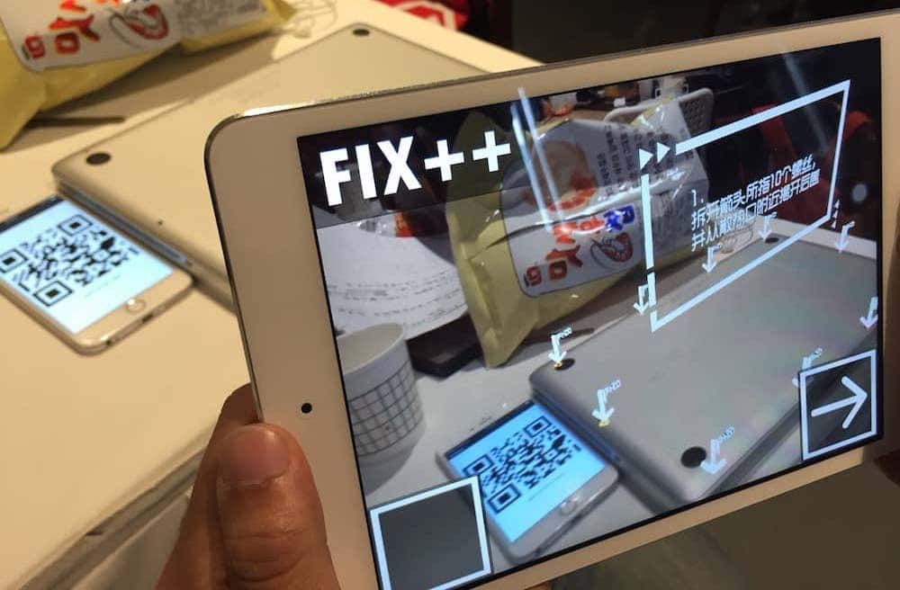

# About
> 1st of Segment Fault 2015 1024 Hackathon. Fix++ is an application with AR SDK to help people to fix Macbooks. Built by hACKbUSTER. It uses Vuforia SDK to track a QR code which is displayed on a companion app, and builds a 3d coordinate system corresponding to the real MacBook. Then we add some 3d arrows on top of the AR layer to make people easier to fix things.

# Screenshots

