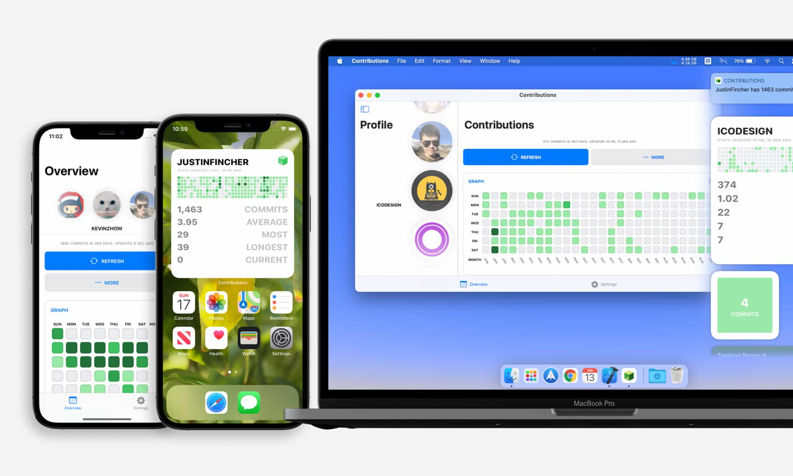

# About
> Contributions for GitHub is a universal app across Apple platforms. It parses the GitHub contributions svg and visualizes the data in commit graph. Contributions for GitHub 1.x was featured by [Product Hunt](https://www.producthunt.com/posts/contributions-for-github) community as #5 Product of the Day on November 21, 2016.

# Releases
> **Contributions 2.0: Modernized Experience.**  
> Since the release of 1.0, the Apple ecosystem has changed a lot. Swift has become mainstream, with frameworks designed specifically using Swift language features, like SwiftUI and WidgetKit. Catalyst, representing Apple's vision of iOS apps on Mac, provides a way for developers to migrate with no effort. GitHub also changed the svg format, with the color field now no longer a hex string but a sass variable.  
> To cope with these changes, I published Contributions for GitHub 2.0 in Jan 2021.

> **Contributions 1.0: Fun Experiment.**  
> Running 3D in a today extension sounds crazy and fun, and that is exactly what Contributions for GitHub 1.0 headed.

