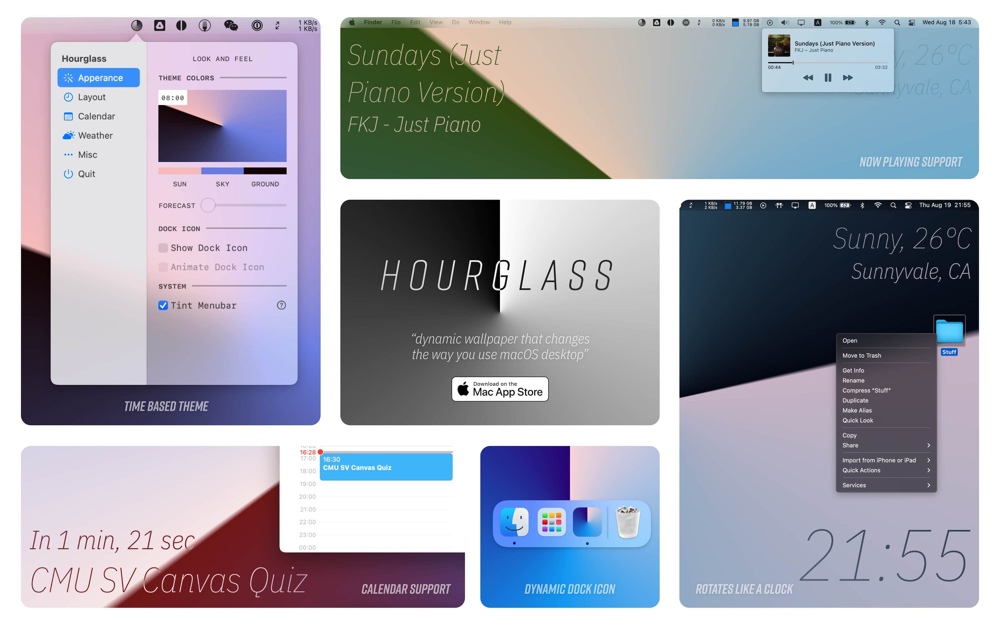
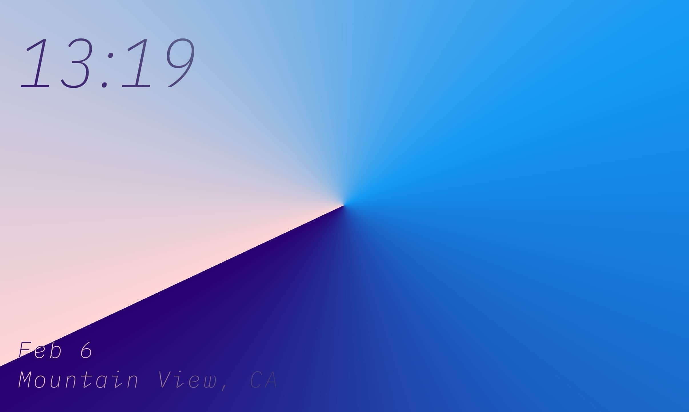

# About
> Hourglass transforms how you use Mac desktop. 
> With a full-screen conical gradient rotating like a clock, your Mac is more lively than ever. 
> Four corners are filled with customizable information, like time, calendar, weather, and now-playing, 
> making Hourglass not only looking good but also working great.

# Origin
> Hourglass was originally a flutter clock contest project. In this [repo](https://github.com/JustinFincher/FlutterClock)
> I explained my thoughts on clockfaces for smart devices like Nest Hub, 
> that I want the device to embrace the environment and become "ambient." 
> Therefore, the interface should be intuitive and effortless. 
> The presentation of information should not be achieved by complex views but rather just geometry, color, and short labels.
> 
> And that is where the conical gradient comes - 
> it rotates like a normal clock, but the color gradient itself is a metaphor for sun, sky, and ground, 
> which animates over time and weather conditions.
> The underlying calculation is done using the HSV (Hue, Saturation, Value) color model, and it is pretty straightforward :
> - Night -> overall darker colors -> V-
> - Day -> overall lighter colors -> V+
> - Hot -> overall more vibrant colors -> S+
> - Foggy -> still bright, but colors faded -> S- V+
> - Rainstorm -> darker, but with contrast -> S+ V-

> I didn't win the flutter clock contest, but the idea of having such an elegant clock stayed in my mind until 
> I figured out I can have it running on macOS as a live wallpaper.

# SwiftUI
> The flutter equivalent in the macOS ecosystem is, naturally, SwiftUI. I took it for a spin, 
and it actually ran pretty well on M1 Macs, even in multi-monitor rendering mode. 
It took me a while to properly bridge NSWindow with SwiftUI because firstly, 
there is currently no multiple windows support in SwiftUI 2 + SceneGroup API, 
and secondly, I had to use a custom NSWindow class to set a window level lower enough to become a live desktop, 
that is, all menu and folder icons will still be displayed on top of my NSWindow.
>
> I even used SwiftUI to [animate the DockTile](https://twitter.com/JustZht/status/1419169508778942467), so the icon will sync with the wallpaper, and it is pretty fun.

# Video
<video class="video-js vjs-default-skin vjs-big-play-centered" controls data='{ "fluid": true, "techOrder": ["youtube"], "sources": [{ "type": "video/youtube", "src": "https://youtu.be/LDHiWnb9WU8"}] }' > </video>