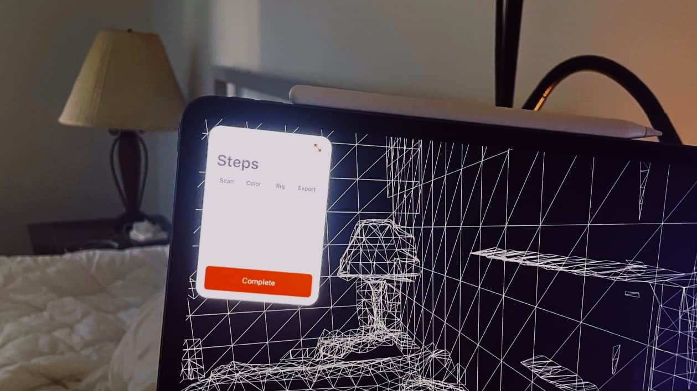
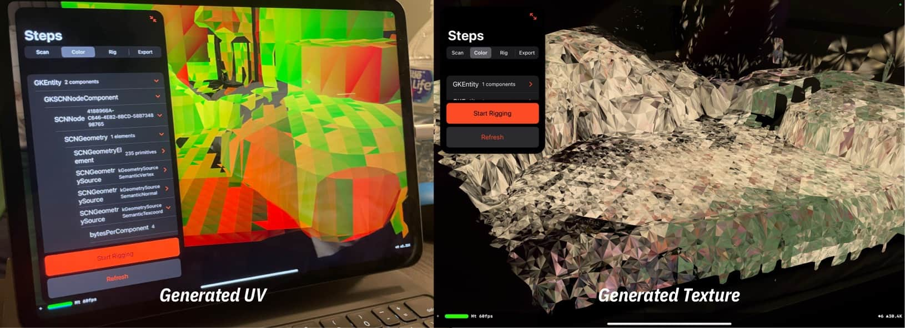
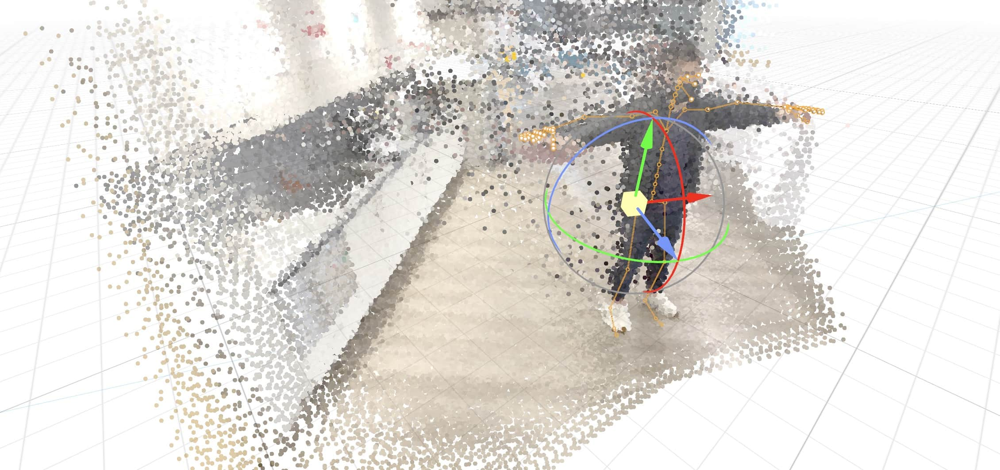
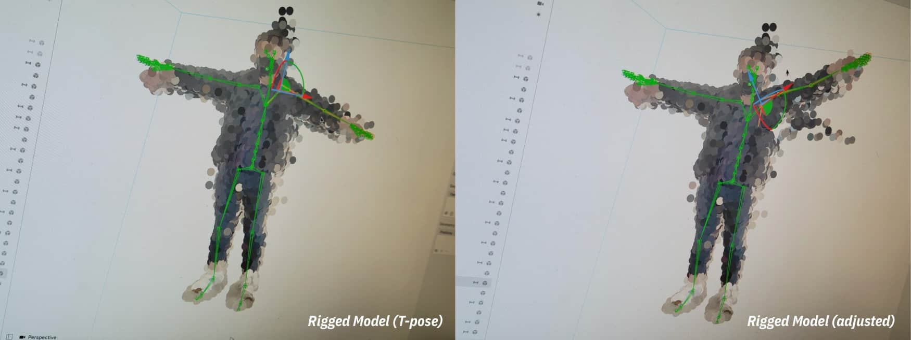

# About
> HumanScan is an experimental project for Apple's WWDC 2021 Scholarship (Swift Student Challenge). It requires devices with Lidar (iPad Pro 2020 and onward) to run.   
> With it, I tried to generate static human model from real world scan, rig it in runtime, and apply skeleton animations so
> the scanned human can make arbitrary poses.

# Video
<video class="video-js vjs-default-skin vjs-big-play-centered" controls data='{ "fluid": true, "techOrder": ["youtube"], "sources": [{ "type": "video/youtube", "src": "https://youtu.be/AT6XDYx_aRg"}] }' > </video>

# Technical Details
> Initially, I tried to use ARKit 4's ARMeshAnchor as a mesh would be the most straightforward solution for model creation.
> The lidar equipped iPad can indeed generate great results:

> However, this is later proven to be insufficient:
> - The mesh is generated without UV
> - The mesh comes with no color or texture
> - The mesh is constantly changing and there is no callback
> 
> I was still in hope that this might work if the color / texture issue can be resolved. The [addUnwrappedTextureCoordinates(forAttributeNamed:)
](https://developer.apple.com/documentation/modelio/mdlmesh/1644690-addunwrappedtexturecoordinates) method in Model I/O seemed promising, but it lacks proper documentation and will crash the app if called.  
> 
> Therefore, I wrote a primitive UV generator to give each triangle a small square in a UV grid. Then, I will make a copy of the generated ARMesh, then project the camera feed onto the scene using hit-test. 
> This approach is also flawed, that:
> - The UV generation algorithm does not take the size or position relationship into account, giving bad results that colors are mixed up in nearby UV grids.
> - The camera-space to model-space hit-test is done in CPU via SceneKit's [SCNHitTestResult](https://developer.apple.com/documentation/scenekit/scnhittestresult/1522771-texturecoordinates), and therefore it can only execute 50-100 times per frame.
> - Added by the offset of pixel color caused by the delay of camera feed in motion and noises in the camera image (keep in mind that sampling is done on a per-pixel basis, so any noise can be disastrous), the output is extremely unstable.
> 
> I can show you what is like to go down this road (**Trypophobia Alert**):

> Yeah, that's my bed and pillow, and I can barely recognize them. This is certainly not gonna win me a WWDC scholarship. So I had to find a way to preserve scanned results with color info.
> Point clouds, although not that smooth when compared to mesh, is actually a good fit for this job, not to mention that Apple has extensive documentation and samples on how to extract point clouds from depth maps.
> So the result is this:

> This is a point-cloud scan done in the CMU INI building, with ARKit 4's skeleton tracking working at the same time.
> The first thing to do is to remove the background points. I don't have the machine learning magic to automatically remove the background, so I took a rather brutal force way -- SDF.  
> 
> As we already have bone information, the human body can be roughly expressed as several primitive 3D shapes combined (head as a sphere, legs as cylinders). Signed distance field can help us convert these cylinders into an equation, 
> so that for a world-space `SCNVector3`, it is within the human body if the result of SDF is < 0, and outside if > 0. 
> 
> With background removed, we can focus on the `SCNSkinner` and rigging. This is a tricky part, not because the lacking of demo and documentation on `SCNSkinner` (although they are, indeed, useless), but 
> because of a bug in SceneKit, that when you generate a SCNSkinner at runtime and re-assign it to another SCNNode, the skinner will collapse -- until you serialize the scene and restore it, then it works as expected.
> It is tricky because you are not gonna seeing it in Xcode and exported scenes, this bug only happens at runtime, which nearly made me abandon the whole project. 
> For a workaround I suggest checking out this [GLTFSceneKit](https://github.com/magicien/GLTFSceneKit/commit/3c80fb707e8729df4ddb7cdf0dd5f7d0119d3d47).

> The rest involves applying a new skeleton position to the existing one so skinner can make point clouds follow the new pose. There is not much to say about this part, you can refer to the [submission](https://github.com/JustinFincher/WWDC2021ScholarshipProject/tree/master/Submission) for more details. 