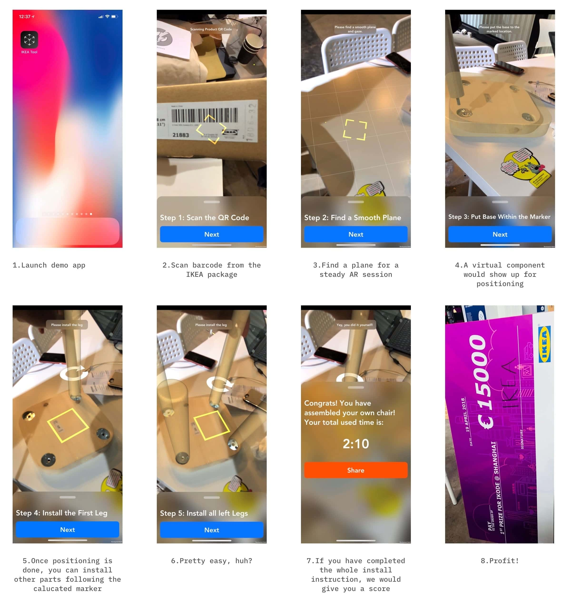

# About
> IKEA IKODE@Shanghai 2018 Hackathon 1st. IKEA Maker uses Unity & ARKit to enhance the experience of assembling.

# Tech Stack
> IKEA Maker was built with Unity 2017.3.0f3. Used assets are listed as below:
> - AVProVideo
> - DOTweenPro
> - EasyTouchBundle
> - TranslucentImage
> - TaskParallel
> - The Amazing Wireframe Shader
> - Beautify
> - ConsolePro
> - SRDebugger

# Workflow

# Video
> Shown below is a demo video recorded in the middle of the hackathon. Notice video tutorial players in each panel are still placeholders as they only play test anime clips at the time of recording. In the final version these animes were replaced with guidance video.

<video class="video-js vjs-default-skin vjs-big-play-centered vjs-16-9" controls data='{"fluid": true}'><source src="https://hackbuster.github.io/IKEA-Maker/GitHub/Videos/Demo.mp4" type="video/mp4"><source src="/works/ikeamaker/demo.mp4" type="video/mp4"></video>
