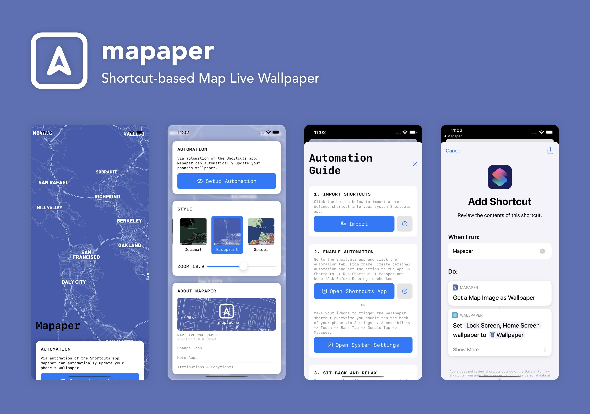
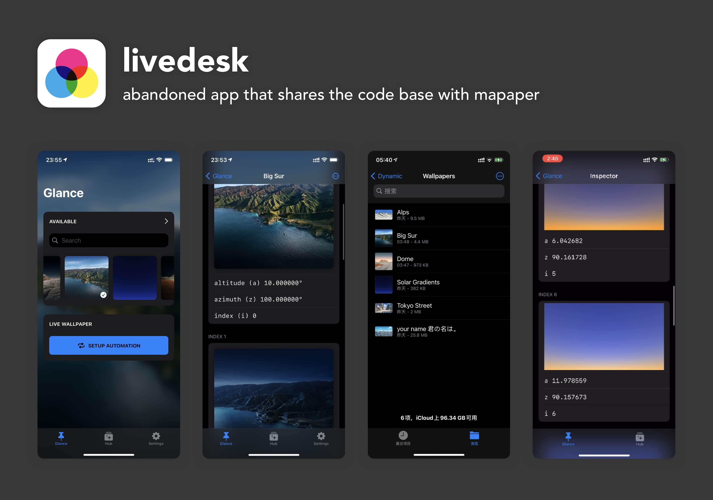

# About
> Published in Jan 2021, Mapaper might be the **first** app to utilize the "Set Wallpaper" shortcut action added in iOS 14.3.  
> With tight integration with Apple's shortcuts app, Mapaper can update your wallpaper with a map whenever it is triggered, let it be a double tap on the back of the phone, a charging notification, a nearby NFC, or just simply a fixed timespan every day. Combined with map styles from Mapbox, Mapaper took the iPhone customization to a whole new level -- mind you, there wasn't an actual 'live wallpaper' app on iOS until Mapaper.
> This isn't just me bragging, or Apple won't select it as **'Apps We Are Loving Right Now'**.  



# Technical Implementation
> Mapaper was built completely with Swift. All the interface was written in SwiftUI. 
> 
> The app includes a custom Siri Intent for the system shortcuts app to recognize as an image provider -- 
> so that the system shortcut app can consequently set the image as wallpaper.
> 
> The hidden restriction of the wallpaper size is that for a square image, its size cannot exceed the half of the longest physical pixel size. That is, 
> ```Swift
> let bounds = UIScreen.nativeBounds
> let maxSize = max (bounds.height, bounds.width) / 2.0
> ``` 
> 
> Or the system shortcuts app will throw `image too large` error. Test on iPhone 12 and iOS 14.3. For moe on this please refer to this [twitter thread](https://twitter.com/JustZht/status/1343601307446210570). 

# Live Demo
<video class="video-js vjs-default-skin vjs-big-play-centered" controls data='{ "fluid": true, "techOrder": ["youtube"], "sources": [{ "type": "video/youtube", "src": "https://youtu.be/nTjN_pdrpYA"}] }' > </video>

> This was captured when I was in Singapore, lol. See the background story if you want to know more about the creation of this small app in a tiny hotel of Singapore.

# Background Story
> Story time! So at the end of 2020, I was in Singapore, trying to get my student visa and fly to the United States from there. Singapore was hot and rainy even in December,
> so most of the time, I was resting in a tiny hotel in tanjong pagar, listening to the rain outside, and trying to get my work done, like student documents, offer letter, etc.
> 
> Then I figured, I am in a totally new place, constantly in need of Google Map every day to navigate, why not build a live map as my iOS wallpaper?
> And that's why Mapaper was born. It then became a companion app that followed me to travel around Singapore, and later, Pittsburgh.
> 
> Again, six months later and I think back, Singapore is still a magical experience. I enjoyed a lot there when I was writing Mapaper. 

# Spin-offs
> Mapaper is actually a shrink-down version of my another app, **LiveDesk**. Later I lose interest in writing LiveDesk, you know, the common syndrome of being an indie developer.
> So I took the shorcuts support from LiveDesk and created Mapaper.  
> LiveDesk is still an interesting idea though, that you can get dynamic wallpaper on iOS -- just like what you get on a Mac. It will recognize the format of dynamic wallpapers used on macOS and change it through time and time of the day. In a way, I am trying to replicate the stock feature of macOS on iOS, and I really hope that LiveDesk can be sherlocked by Apple.  
> Some dev screenshots:

