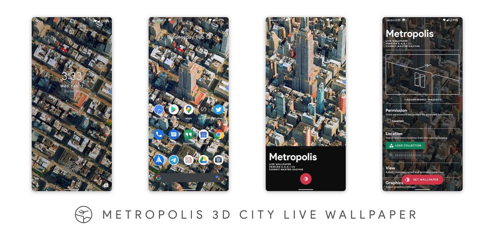
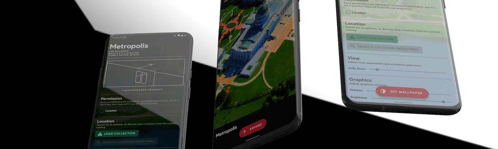

# About
> The Pixel-like Live Wallpaper series is finally complete.  
> Now you can find direct counterpart for each category in the stock Pixel Live Wallpaper.  
> - For natural scenery, there is [Skyline](/skylinelwp).   
> - For data-driven visualization, there is [Vortex](/vortexlwp).   
> - And for urban scenery, introducing **Metropolis**. 

# Idea
> I wrote my own Unity-Android live wallpaper framework, UniLWP, in Jan, 2020, and Vortex was the first app to be converted to use UniLWP. It runs well, which further validates my plan in converting all my Unity-based live wallpapers into UniLWP.Droid based apps.  
> Then just when I was about to do the same thing to Skyline and made a 3.0 version with UniLWP, I came across the [Bing Maps Unity SDK](https://github.com/microsoft/MapsSDK-Unity), a SDK that shares the same data source with Windows 3D Maps (and potentially the incoming Microsoft Flight Simulator). If combined with UniLWP.Droid, this would fill the gap previously left out by Skyline: **urban, drone-scanned 3D city scenes**.
>  
> And here it is, Metropolis, a live wallpaper with 100+ city scenes in online collections, including:
> - The Empire State Building
> - The Statue of Liberty
> - Paris Las Vegas
> - Transamerica Pyramid
> - Battleship New Jersey
> - BC Place Stadium
> - Bordeaux Cathedral
> - And more

# Video
<video class="video-js vjs-default-skin vjs-big-play-centered" controls data='{ "fluid": true, "techOrder": ["youtube"], "sources": [{ "type": "video/youtube", "src": "https://www.youtube.com/watch?v=p_b_p9K1AoU"}] }' > </video>

> The video was rendered in Adobe AE and Keyshot.

# Website
> A little nice touch: the product website ([getmetro.app](https://getmetro.app)) is made with WebGL, and you can interact with the mockup phone on the web page as if it is a real working app. The website itself is built with Vue.js and Babylon.js.

# Misc
> I know a lot of people might be skeptical about using Unity to develop live wallpaper apps, and I certainly understand the concern. After all, it is like running a Unity game on your phone all the time, which normally costs huge battery life and memory.  
>However, as the time of me writing this (roughly about 3 months after Metropolis' initial release), Xiaomi officially unveiled MIUI 12, in which they developed a similar live wallpaper called '[Super Wallpaper](https://www.androidauthority.com/xiaomi-miui-12-launch-release-date-eligible-phones-features-1111755/)'.  
>Now, as Xiaomi has joined the game of 3D live wallpapers after Google and I myself, I can confidently say that using Unity is not a sin or something like that, especially when Xiaomi is also using Unity. :-P

