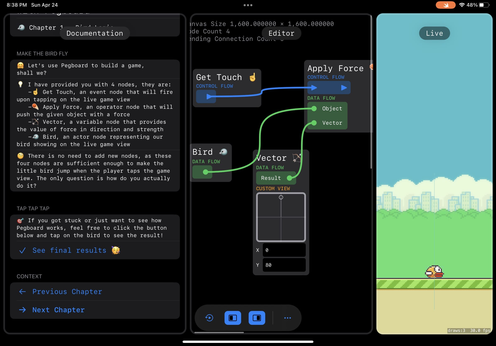

# About
> Pegboard is a Swift Playground app for WWDC 22 Swift Student Challenge. It is a creative workspace with node-based scripting editor built-in and was purely written in SwiftUI.

# Video
<video class="video-js vjs-default-skin vjs-big-play-centered" controls data='{ "fluid": true, "techOrder": ["youtube"], "sources": [{ "type": "video/youtube", "src": "https://www.youtube.com/watch?v=B6D3y49WOEQ"}] }' > </video>

# Why do this

> Some people might know me by my WWDC 20 Swift Student Challenge winner submission, <a href="https://portfolio.justzht.com/shadernode" target="_blank">Shader Node</a>, 
> and wonder why I made yet another a node editor.   
> Sure, **Shader Node** is also a node-based editor running on iOS, and you can find visual similarities between the two. 
> However, Shader Node is a shader editor, the generated shader code is directly fed into SpriteKit and there is nothing more than that, SpriteKit will handle the rendering without our control.  
> **Pegboard**, on the other hand, is a scripting editor, the playground not only needs to parse the graph, but to execute it. That is the main
> difference and will bring up a lot of implications I wouldn't be noticing at the beginning of this project.  
> Besides, from a retrospective standpoint, Shader Node is 'old' as it was using UIKit and UIKit Dynamics for the interface. I spent a lot of time
> on working out the layout math when dealing with the node interface. That is no longer a problem with SwiftUI, as the node interface is self-sizing now. The bezier lines now can be drawn using the Canvas API, so 
> it feels like a good time to rewrite my node editor UI in pure SwiftUI.

# Why the name
> The project used to be named 'script node editor'. Not to say anything wrong with it, but it is at least very boring.  
> When demonstrating my project, I received a valuable piece of advice from a veteran in the industry, that the project name should be sensible to end users, and should lead to immediate understanding of its target usage.  
> That is why I changed the name to 'Pegboard', and by Pegboard, I mean the SKÅDIS Pegboard sold at IKEA. Node editor is in
> some way a metaphor for it: they both function as a canvas, they both have accessories (or nodes, in a digital term) of different functions attached to them. You can move items from one accessory to another, just like you can move data from one node to another.

# More screenshots

 

  
<b>Click to see additional images</b>

 

