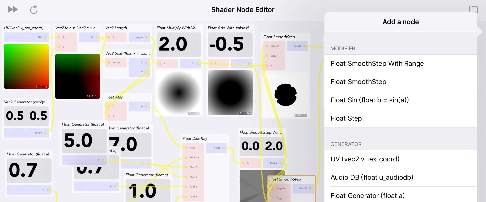

# About
> Shader × Node is a side project started in March 2019. Initially it was written in Objective-C, then ported to Swift 4.2 (in a Swift Playground) for the WWDC 19 scholarship application. Shader × Node features a self made node editor system using UIKit Dynamics (with no 3rd party lib used). Later on SpriteKit and AVFoundation were added to the project to function as a VJ visualization app.  
You can drag and drop various node into the canvas can connect each other. There are generator nodes (like time, audio loudness and uv) and calculator nodes (like add, multiply and lerp). Together you can achieve amazing shader effects in this app.



# Video
> What you are about to see is a demo video for WWDC Scholarship Submission. The complex shader displayed at the 1:02 is actually equivalent to the code below.

```c
 #ifdef GL_ES
 precision mediump float;
 #endif
 
 uniform vec2 u_resolution;
 uniform float u_time;
 uniform float u_audiodb;
 
 void main()
 {
     vec2 st = gl_FragCoord.xy/u_resolution.xy;
     vec2 pos = vec2(0.5)-st;
     float r = length(pos)*2.0;
     float a = atan(pos.y,pos.x);
 
     float f = smoothstep(10.0 * (1.0 - u_audiodb)),0.5,sin(a * 5.0 + u_time) * 0.7 + cos(a * 7.0) * 1.0);
     float s = smoothstep(0.0,2.0,f);
     vec3 colorIn = vec3(1.0- smoothstep(s,s,r - 0.5));
     vec3 colorOut = vec3(1.0- smoothstep(s,s,r - 0.2));
     gl_FragColor = vec4(colorIn - colorOut, 1.0);
 }
```

<video class="video-js vjs-default-skin vjs-big-play-centered" controls data='{ "fluid": true, "techOrder": ["youtube"], "sources": [{ "type": "video/youtube", "src": "https://www.youtube.com/watch?v=otw49ioAm2U"}] }' > </video>

# Screenshots


# Roadmap
> Sadly this thing didn't win me a WWDC Scholarship. I guess that's just bad luck.    
An iOS version of Shader Editor packing logic operators and unity shader export features is on the plan.   
A Unity & UIWidgets based node scripting editor is being developed using the same structure. You can follow the development on my Twitter & Blog. Current progress includes a [proper macOS & Chrome tab style UI](https://twitter.com/JustZht/status/1119124263795957761) and [monobehaviour callback support](https://twitter.com/JustZht/status/1118038675739164672).  


