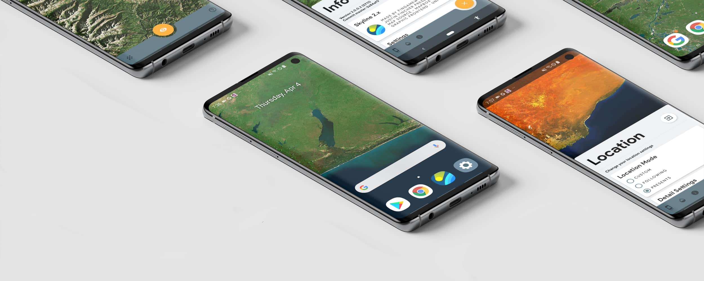
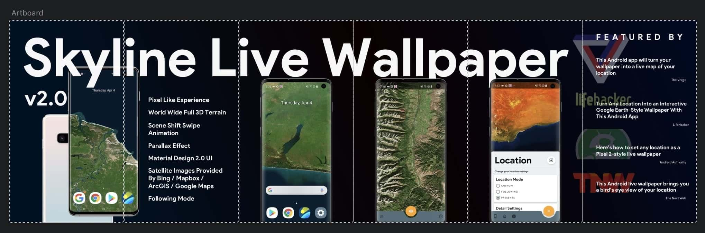
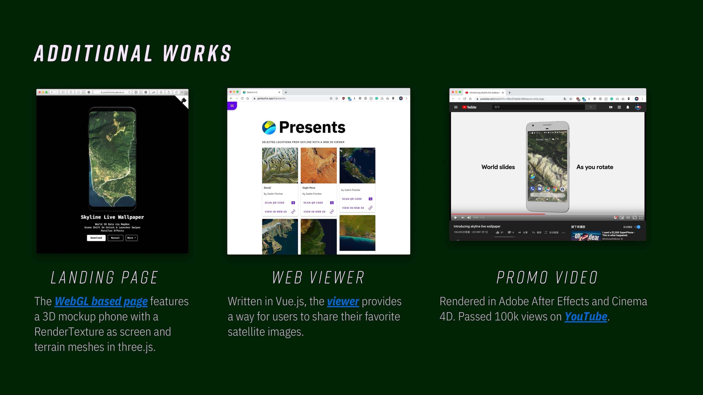
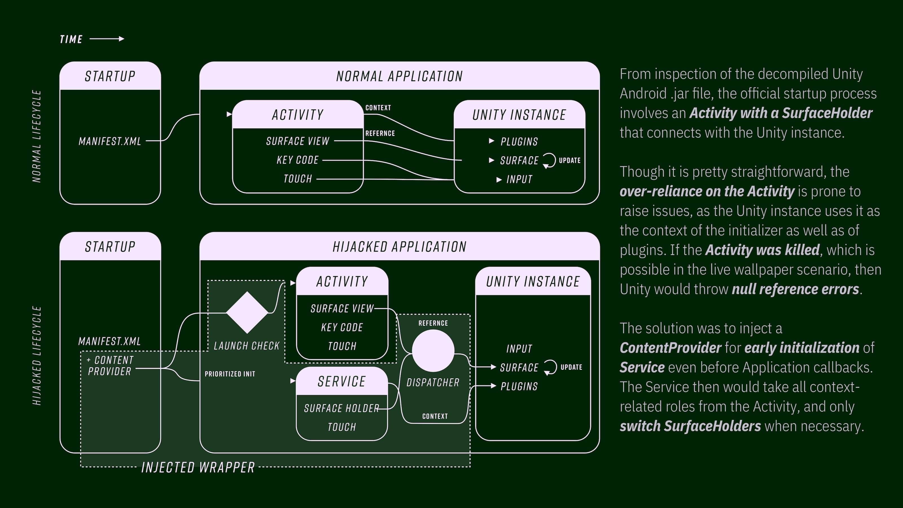
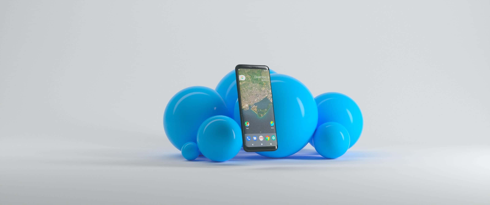

# About

> **Skyline Live Wallpaper is an Android app built with Unity Game Engine.**   
It provides a similar experience to the [Pixel Wallpapers from B-Reel](https://www.b-reel.com/work/google-pixel-wallpapers), but with more view options and unlimited satellite images & 3D terrain data.  
Skyline was featured by [The Verge](https://www.theverge.com/circuitbreaker/2018/1/20/16909558/skyline-android-app-wallpaper-live-map-location), [The Next Web](https://thenextweb.com/apps/2018/01/22/get-a-birds-eye-view-of-your-location-on-your-android-home-screen-with-this-live-wallpaper/), [Android Authority](https://www.androidauthority.com/skyline-pixel-2-style-live-wallpaper-831213/) and [Lifehacker](https://lifehacker.com/this-android-app-turns-any-location-into-an-interactive-1822205429), and used to be the [top 1](https://www.appannie.com/apps/google-play/top-chart/?country=US&category=1&device=&date=2018-01-22&feed=All&rank_sorting_type=rank&page_number=0&page_size=100&table_selections=) of the Google Play Apps most downloaded list in US (Data source: App Annie, 2018.1.21 - 2018.1.25).

# Video
<video class="video-js vjs-default-skin vjs-big-play-centered" controls data='{ "fluid": true, "techOrder": ["youtube"], "sources": [{ "type": "video/youtube", "src": "https://www.youtube.com/watch?v=v6bcGHqtQL0"}] }' > </video>
  
# Releases
> **Skyline 2.0: a rewrite from ground-up, packing more features and a Material Design 2.0 UI.**   
> Released in Mar 2019, Skyline 2.0 is internally built with Unity 2018.3.x, with LWRP and Post Processing Stack enabled. The UI has been moved to the native side by using Android X and Material Component. These changes would make 2.0 more battery-friendly than 1.0. 
> Skyline 2.0 now has a new landing page built with Vue.js along with a new domain: [getskyline.app](https://getskyline.app/). The new landing page also functions as an online terrain presents & changelog viewer.

> **Skyline 1.0: an initial attempt to make a live wallpaper with Unity.**  
Released in Nov 2017, Skyline 1.0 was at first a side project. I was amazed by the pre-installed Pixel Wallpapers on my Pixel Phone 1st gen, and I wondered if I can achieve the same experience using different tech stacks. Then Skyline was then made using the Unity Game Engine and Mapbox Unity SDK. There was also a full 3D [web landing page](https://github.com/JustinFincher/ProjectSkylineLandingWebGL) for the Skyline 1.0, which was made using three.js and Mapbox Web API.  
Skyline went viral (sort of) at the beginning of 2018, as The Verge featured it in one of their circuit breaker series. At that time, the Skyline was still treated as a side project that is for fun and for my own personal use. It would run just fine on my Pixel Phone (Snapdragon 821) but not on mid or entry class phones, so the rating dropped quickly after it hit the Google Play most paid list as no.2. I was about to fix the issue, however the Unity-based tech stack is just too heavy for an always background alive app.

