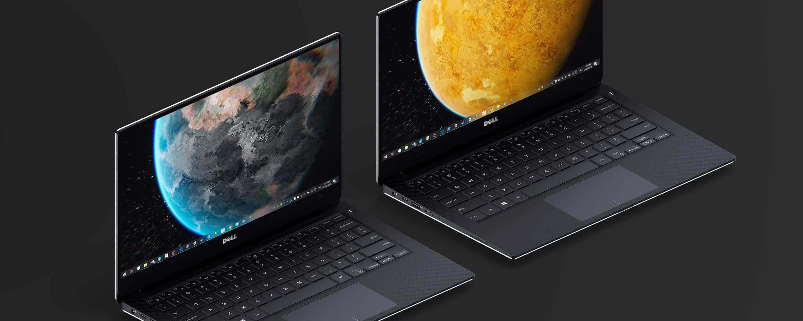

# About
> Starry is a live wallpaper for Windows 10. It is powered by Unity Game Engine and WinForms, and is part of the "Unity Based LWP on All Major Platform" series.  
The tech behind it is deadly simple: use User32 API to make the Unity player window works as a borderless background.

# Video
> What you are seeing in the video below was an attempt to animate the camera with Cinemachine, controlled by a simple system tray menu.

<video class="video-js vjs-default-skin vjs-big-play-centered" controls data='{ "fluid": true, "techOrder": ["youtube"], "sources": [{ "type": "video/youtube", "src": "https://www.youtube.com/watch?v=_vMf1gWSe5Y"}] }' > </video>
