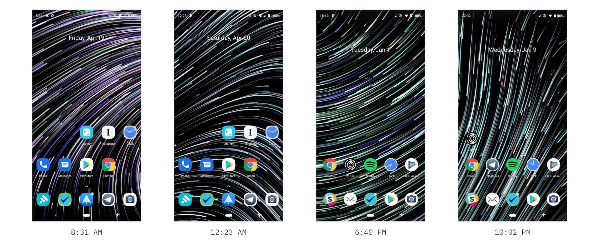

# About
> Vortex is a data-driven live wallpaper. The flowing particles move along with a whirling motion, and that motion is calculated from the real world data: weather, temperature, sunrise & sunset, walking or running, they all contribute to the living particle system, right at your home screen.  
Vortex was featured on [Android Police](https://www.androidpolice.com/2018/12/22/13-new-and-notable-android-apps-and-live-wallpapers-from-the-last-week-including-memoria-philo-and-mint-browser-12-15-18-12-22-18/) and [少数派](https://sspai.com/post/52842).

# Screenshots
> Vortex is actually (yet again) built with Unity Game Engine, and this time the performance is pretty great. It would easily hit 400 fps on a Macbook Pro, though the framerate is limited to 30fps on mobile devices in order to save battery.   
Google Awareness API is used as data source. There is a built-in color gradient curve applied to the particles, which also adapts to the local sunrise & sunset time. If the weather is stormy, vortex would generate more turbulence in the force field. 

# Video
> A time-lapse mode was introduced in the 0.0.0.12 (181) version.

<video class="video-js vjs-default-skin vjs-big-play-centered" controls data='{ "fluid": true, "techOrder": ["youtube"], "sources": [{ "type": "video/youtube", "src": "https://www.youtube.com/watch?v=-tZrrraiDHU"}] }' > </video>
  
